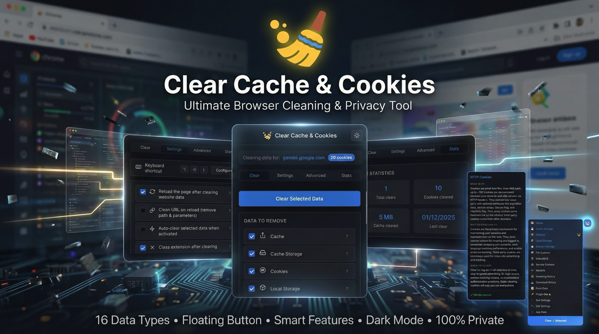
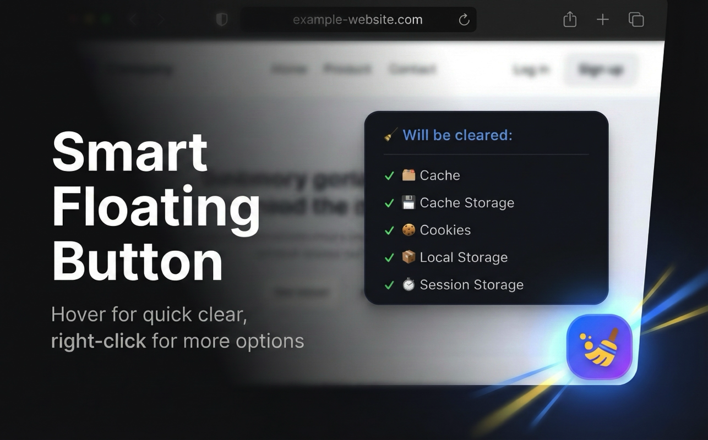
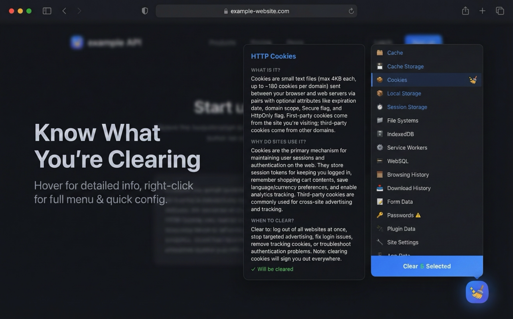
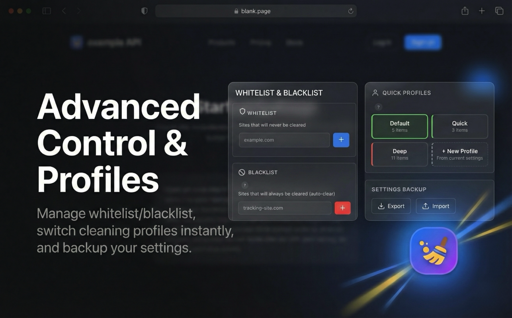

# Clear Cache & Cookies

A powerful Chrome extension for clearing browsing data with a single click. Clear 16 different data types, manage site whitelists/blacklists, and use the floating quick-access button on any page. Built with React, TypeScript, and Vite using Manifest V3.

## Screenshots

| Overview | Floating Button |
|:--------:|:---------------:|
|  |  |

| Context Menu & Tooltips | Advanced Settings |
|:-----------------------:|:-----------------:|
|  |  |

## Features

### 16 Data Types to Clear

**Basic:**
- **Cache** - Browser HTTP cache for pages and resources
- **Cache Storage** - Service worker cache storage
- **Cookies** - Site cookies and session data
- **Local Storage** - Persistent key-value storage
- **Session Storage** - Session-scoped storage

**Advanced:**
- **File Systems** - Browser file system storage
- **IndexedDB** - Client-side database storage
- **Service Workers** - Background worker scripts
- **WebSQL** - Legacy database storage

**Additional:**
- **Browsing History** - Pages you've visited
- **Download History** - Downloaded files log
- **Form Data** - Autofill form entries
- **Passwords** - Saved login credentials ⚠️
- **Plugin Data** - Browser plugin storage
- **Site Settings** - Per-site permissions
- **App Data** - Installed PWA data

### Smart Features

- **Floating Button** - Draggable button on every page with hover preview showing what will be cleared
- **Whitelist** - Protect specific sites from clearing
- **Blacklist** - Auto-clear data when visiting specific sites
- **Context Menu** - Right-click on any page for quick access to all data types
- **Keyboard Shortcut** - Alt+Shift+L (Option+Shift+L on macOS)

### Behavior Settings

- **Auto-reload** - Refresh page after clearing to apply changes
- **Clean URL** - Strip path and query parameters on reload
- **Auto-clear on activate** - Clear data when popup opens
- **Auto-close** - Close popup after clearing completes
- **Clear on tab close** - Auto-clear when closing a tab
- **Clear on startup** - Clear data when browser starts
- **Desktop notifications** - Confirm what was cleared
- **Cookie count badge** - Show cookie count on extension icon

### Design

- **Dark & Light theme** - System-aware theme support
- **Modern glassmorphism UI** - Beautiful, modern interface
- **Detailed tooltips** - Learn what each data type does
- **Settings sync** - Sync preferences across devices

## Installation

### From Releases

1. Download `clear-cache-cookies-v1.0.0.zip` from [Releases](https://github.com/suatkocar/clear-cache-and-cookies/releases)
2. Extract the ZIP file
3. Navigate to `chrome://extensions`
4. Enable **Developer mode**
5. Click **Load unpacked**
6. Select the extracted folder

### From Source

```bash
git clone https://github.com/suatkocar/clear-cache-and-cookies.git
cd clear-cache-and-cookies
npm install
npm run build
```

Then load the `dist` directory in Chrome.

## Project Structure

```
clear-cache-and-cookies/
├── public/
│   ├── manifest.json      # Extension manifest
│   ├── content.js         # Floating button script
│   └── icons/             # Extension icons
├── src/
│   ├── App.tsx            # Main popup component
│   ├── App.css            # Popup styles
│   ├── background/        # Background service worker
│   ├── content/           # Content script styles
│   ├── types/             # TypeScript types
│   └── utils/             # Utility functions
├── docs/                  # Documentation
├── releases/              # Release packages
└── dist/                  # Build output
```

## Tech Stack

- **React 19** - UI framework
- **TypeScript** - Type safety
- **Vite** - Build tool
- **Chrome Extension Manifest V3**
- **Chrome APIs** - browsingData, storage, tabs, scripting, cookies, notifications, contextMenus

## Development

```bash
npm run dev      # Start development server
npm run build    # Create production build
npm run lint     # Run ESLint
npm run zip      # Create distribution package
```

## Privacy

This extension does not collect, store, or transmit any personal data. All settings are stored locally using Chrome's sync storage API. No analytics, no tracking.

See [Privacy Policy](PRIVACY_POLICY.md) for details.

## Author

**Suat Kocar**  
Email: suatkocar.dev@gmail.com

## License

This project is licensed under the [MIT License](LICENSE).
