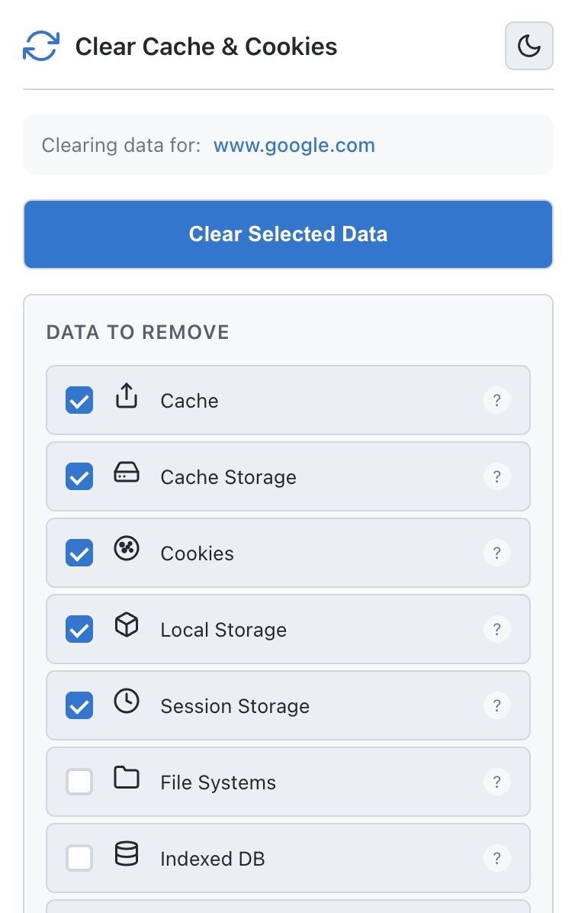
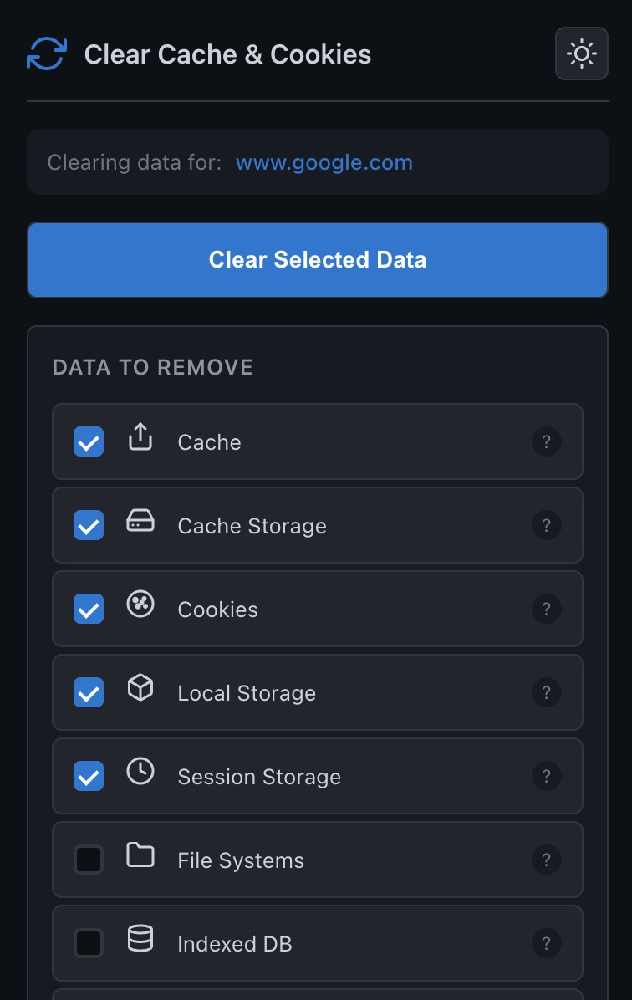
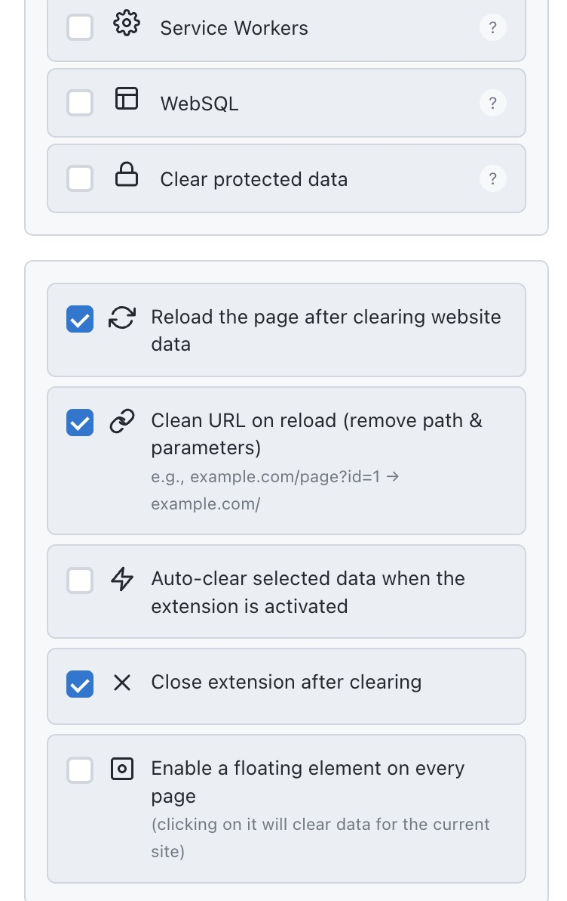
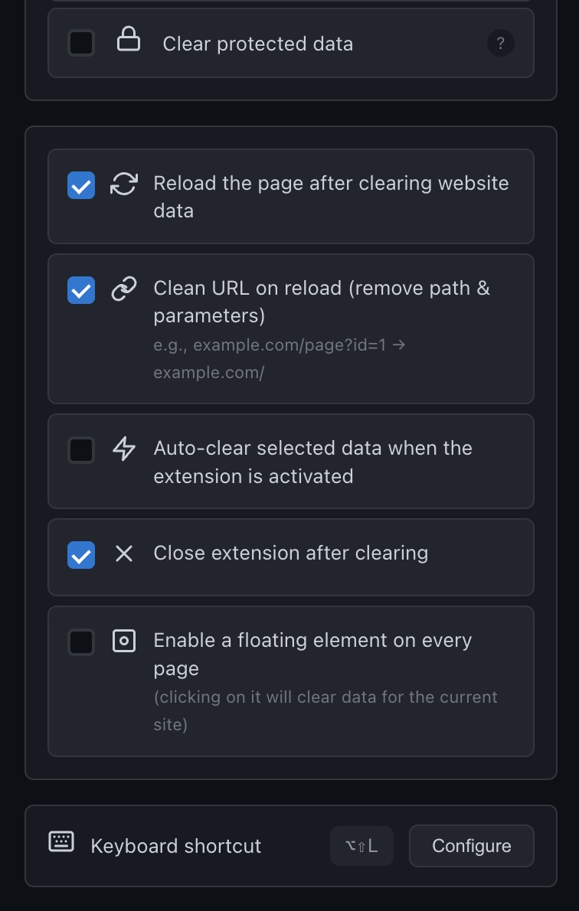

# Clear Cache & Cookies

A Chrome extension for clearing browsing data (cache, cookies, storage) for the current website with a single click. Built with React, TypeScript, and Vite using Manifest V3.

## Screenshots

| Light Mode | Dark Mode |
|:----------:|:---------:|
|  |  |
|  |  |

## Features

### Data Clearing Options

- **Cache** - Browser cache for web pages and resources
- **Cache Storage** - Service worker cache storage
- **Cookies** - Site cookies and session data
- **Local Storage** - Persistent key-value storage
- **Session Storage** - Session-scoped storage
- **File Systems** - Browser file system storage
- **IndexedDB** - Client-side database storage
- **Service Workers** - Background worker scripts
- **WebSQL** - Legacy database storage

### Behavior Settings

- **Auto-reload** - Automatically reload the page after clearing
- **Clean URL** - Strip path and query parameters on reload
- **Auto-clear** - Clear data immediately when extension opens
- **Auto-close** - Close popup after clearing completes
- **Floating Button** - Quick-access button overlay on pages
- **Protected Data** - Include protected/session cookies

### Additional Features

- **Keyboard Shortcut** - Alt+Shift+L (Option+Shift+L on macOS)
- **Theme Toggle** - Dark and light mode support
- **Settings Sync** - Sync preferences across devices via Chrome

## Installation

### From Source

```bash
npm install
npm run build
```

### Load in Chrome

1. Navigate to `chrome://extensions`
2. Enable **Developer mode**
3. Click **Load unpacked**
4. Select the `dist` directory

## Project Structure

```
clear-cache-and-cookies/
├── public/
│   ├── manifest.json
│   ├── content.js
│   └── icons/
├── src/
│   ├── App.tsx
│   ├── App.css
│   ├── background/
│   ├── content/
│   ├── types/
│   └── utils/
├── scripts/
└── dist/
```

## Tech Stack

- React 19
- TypeScript
- Vite
- Chrome Extension Manifest V3
- Chrome APIs (browsingData, storage, tabs, scripting)

## Development

```bash
npm run dev      # Development server
npm run build    # Production build
npm run lint     # Code linting
npm run zip      # Create distribution package
```

## Privacy

This extension does not collect, store, or transmit any personal data. All settings are stored locally using Chrome's sync storage API. See [Privacy Policy](PRIVACY_POLICY.md) for details.

## Author

**Suat Kocar**  
Email: suatkocar.dev@gmail.com

## License

This project is licensed under the [MIT License](LICENSE).
